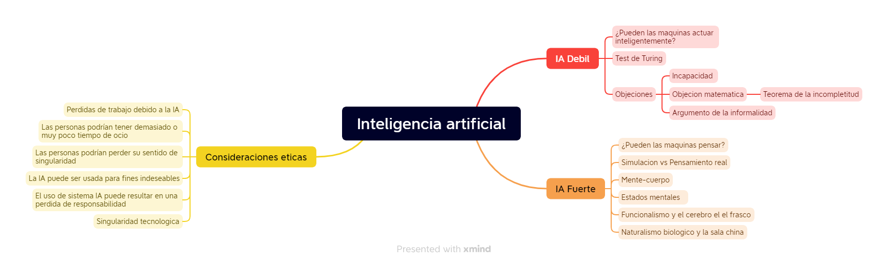

# TP1 Fundamentos IA

## Ejercicio 1

En el texto se abordan las distintas perspectivas sobre la inteligencia artificial, junto con el analisis de las distintas implicancias eticas que puede tener cada enfoque.

### Inteligencia Artificial débil

La idea de que las maquinas pueden actuar como si fueran inteligentes es llamada hipótesis de inteligencia artificial débil. Se plantea que el debate sobre si la maquinas puede pensar es absurdo, comparándolo con la idea de si los submarinos nadan o los aviones vuelan.  

En 1950, Alan Turing propone el test de Turing como una prueba para determinar si una maquina es capaz de hacerse pasar por un humano. Consiste en un interrogador que mantiene una conversación textual con una persona o máquina, y el interrogador debe decidir si este es humano o máquina. Se establece que un programa pasa el test si engaña al interrogador el 30% de las veces. Aunque muchas personas ya han sido engañadas por diversos programas y chatbots. 

Turing evaluó una serie de objeciones a la posibilidad de máquinas inteligentes, incluyendo todas las que han aparecido desde la publicación de su artículo. 

#### El argumento de la incapacidad: 
Proclama que una maquina nunca puede hacer X. Como ejemplo Turing contempla la siguiente lista:  
Ser amable, útil, bella, amigable, tener iniciativa, tener sentido del humor, distinguir correcto de incorrecto, cometer errores, enamorarse, disfrutar frutilla y crema, entre otras.  
De hecho los programas pueden hacer muchas cosas igual o mejor que los humanos, incluso cosas que la gente cree requieren una gran habilidad de conocimiento y entendimiento, lo cual no implica que las computadoras usan estas habilidades al realizar estas tareas.    

#### La objeción matemática: 
Es conocido que los trabajos de Turing y Godel plantean preguntas en principio irrespondibles por sistemas formales particulares. El teorema de la incompletitud es una prueba de esto. Este teorema enuncia que para cualquier sistema formal axiomático F lo suficientemente poderoso para realizar aritmética, es posible construir una llamada sentencia de Gödel G(F) tal que: 
* G(F) es una afirmación de F que no puede ser probada dentro de F. 
* Si F es consistente, entonces G(F) es verdadera. 

Distintos filósofos afirman que este teorema demuestra que las maquinas son mentalmente inferiores que los humanos, ya que son sistemas formales limitados por este teorema, mientras que los humanos no. A continuación se explayan tres problemas de esta afirmación: 

* El teorema de Gödel aplica solo a sistemas formales lo suficientemente poderosos para realizar aritmética. Esto incluye maquinas de Turing, basándose esta afirmación principalmente en la nocion de que las computadoras son MT. Considerando que estas son infinitas, mientras que las computadoras finitas, podemos decir que pueden ser descriptas como un gran sistema en lógica proposicional, los cuales no están sujetos a la afirmación del teorema. 
* En segundo lugar, un agente no debería sentirse demasiado avergonzado por no poder establecer la verdad de una oración mientras otros agentes pueden.  
* Tercero, y más importante aún, incluso si concedemos que las computadoras tienen limitaciones en lo que pueden demostrar, no hay evidencia de que los humanos sean inmunes a esas limitaciones. Es demasiado fácil demostrar rigurosamente que un sistema formal no puede hacer X, y luego afirmar que los humanos pueden hacer X usando su propio método informal, sin proporcionar ninguna evidencia para esta afirmación. De hecho, es imposible demostrar que los humanos no están sujetos al teorema de la incompletitud de Gödel, porque cualquier prueba rigurosa requeriría una formalización del talento humano no formalizable afirmado, y por lo tanto se refutaría a sí misma. 

#### El argumento de la informalidad: 
Uno de las críticas más influyentes de la inteligencia artificial fue postulada por Turing como el argumento de la informalidad del comportamiento. Esencialmente postula que la conducta humana es por lejos muy compleja para ser capturada por un conjunto simple de reglas y que por eso las computadoras no pueden hacer mas que seguir un conjunto de reglas, siendo incapaces de generar una conducta inteligente como los humanos. La incapacidad de capturar todo en un conjunto de leyes lógicas es llamada el problema de la cualificación en la IA. 

### Inteligencia Artificial fuerte. 

La idea de que las maquinas que pueden actuar como si fueran inteligentes están efectivamente pensando es llamada la hipótesis de la inteligencia artificial fuerte. 

Muchos filosofos indican que el hecho de que una maquina que pase el test de turing, no necesariamente esta pensando, sino que puede estar simulando el pensamiento. Turing anticipa esta objeción al citando un discurso, donde se plantea que solo cuando una máquina pueda escribir un soneto o componer un concierto a partir de pensamientos y emociones, y no por la casualidad de símbolos, podríamos considerar que la máquina es equivalente al cerebro.

Turing introduce el "argumento de la conciencia", afirmando que una máquina debe ser consciente de sus propios estados mentales y acciones. Aunque destaca la conciencia y la experiencia directa (fenomenología), otros se centran en la intencionalidad, cuestionando si las creencias y deseos de la máquina son genuinamente acerca del mundo real. La respuesta de Turing es notable; en lugar de argumentar a favor de la conciencia de las máquinas, considera que la pregunta es tan mal definida como la cuestión "¿Pueden las máquinas pensar?" Se pregunta por qué se impone un estándar más alto a las máquinas en comparación con los humanos, señalando que en la vida cotidiana, los humanos carecen de evidencia directa de los estados mentales internos de los demás. Turing sugiere adoptar una convención educada que asuma que todos piensan en lugar de participar en un debate constante sobre este punto. 

Se habla de que se puede imaginar un punto donde pensamiento artificial y real, dejen de ser distinguidos. En el ámbito del pensamiento, hay quienes creen que el pensamiento artificial, por más impresionante que sea, nunca será real. Por ejemplo, el filósofo John Searle (1980) argumenta que nadie supondría que una simulación por computadora de una tormenta nos dejaría mojados. ¿Por qué alguien en su sano juicio supondría que una simulación por computadora de procesos mentales realmente tiene procesos mentales? 

Aunque es fácil estar de acuerdo en que las simulaciones por computadora de tormentas no nos mojan, no está claro cómo llevar esta analogía a las simulaciones de procesos mentales por computadora. La mayoría de las personas se sienten cómodas diciendo que una simulación por computadora de la suma es una suma y que una simulación de ajedrez es ajedrez. De hecho, típicamente hablamos de una implementación de la suma o el ajedrez, no de una simulación. 

Los esfuerzos filosóficos para resolver este problema mente-cuerpo son directamente relevantes para la cuestión de si las máquinas podrían tener mentes reales. El problema mente-cuerpo enfrentado por los dualistas es cómo la mente puede controlar el cuerpo si ambos son realmente separados. A diferencia de estos, La teoría monista de la mente, a menudo llamada fisicalismo, evita este problema al afirmar que la mente no está separada del cuerpo, es decir, que los estados mentales son estados físicos. el fisicalismo permite, al menos en principio, la posibilidad de una IA fuerte. El problema para los fisicalistas es explicar cómo los estados físicos, en particular, las configuraciones moleculares y los procesos electroquímicos del cerebro, pueden ser simultáneamente estados mentales. 

#### Los estados mentales y el cerebro en el tanque

Los filósofos fisicalistas han intentado explicar lo que significa decir que una persona, y por extensión una computadora, se encuentra en un estado mental particular, centrándose especialmente en los estados intencionales, como creer, conocer, desear o temer. Si el fisicalismo es correcto, la descripción adecuada del estado mental de una persona debe determinarse por el estado cerebral de esa persona. Sin embargo, esta perspectiva se ve desafiada por experimentos mentales, como la idea de un cerebro en un tanque con señales simuladas, lo que plantea la cuestión de si el contenido mental puede interpretarse desde dos puntos de vista: el "contenido amplio" que considera tanto el estado cerebral como la historia del entorno, y el "contenido estrecho" que se enfoca solo en el estado cerebral. 

Esta dicotomía entre el contenido amplio y estrecho sugiere que, si bien el contenido amplio es apropiado para ascribir estados mentales a otros y predecir su comportamiento, el contenido estrecho es más relevante cuando se trata de determinar si los sistemas de inteligencia artificial realmente piensan y poseen estados mentales. Además, el contenido estrecho es fundamental al considerar el diseño y la comprensión de los sistemas de inteligencia artificial, ya que su papel funcional dentro de las operaciones mentales es lo que determina su contenido mental específico. 

#### El funcionalismo y el experimento del reemplazo de cerebro

El funcionalismo sostiene que un estado mental es cualquier condición causal intermedia entre la entrada y la salida. Según esta teoría, dos sistemas con procesos causales isomórficos tendrían los mismos estados mentales. Se ilustran las afirmaciones del funcionalismo a través del experimento de reemplazo cerebral, que plantea la posibilidad de reemplazar gradualmente todas las neuronas en la cabeza de alguien con dispositivos electrónicos que replican su comportamiento neural. La controversia surge al considerar si la conciencia persistiría durante y después del reemplazo.   

El experimento plantea un choque de intuiciones entre quienes creen que la conciencia persistiría (como Moravec) y aquellos que sostienen que desaparecería (como Searle). Este debate se complica al considerar que, si la conducta externa del sujeto debe permanecer inalterada, la voluntad del sujeto debe eliminarse instantáneamente durante el reemplazo gradual de las neuronas. Además, al preguntar al sujeto sobre su experiencia consciente durante la etapa sin neuronas reales, las respuestas aparentan normalidad, lo que plantea preguntas sobre la relación entre la conciencia y la función cerebral. 

Se exploran tres posibles conclusiones, y se sugiere que si la segunda opción fuera cierta, reduciría la conciencia a un papel epifenoménico. Esto significa que, según algunos filósofos, la conciencia sería algo que ocurre pero que no proyecta ninguna sombra en el mundo observable. Además, si la conciencia es epifenoménica, la experiencia consciente del dolor al decir "Ouch" debería atribuirse a un segundo mecanismo inconsciente en el cerebro en lugar de la experiencia consciente del dolor. Patricia Churchland señala que los argumentos funcionalistas pueden aplicarse no solo a nivel de neuronas, sino también a unidades funcionales más grandes, como módulos mentales o incluso el cerebro completo. Esto plantea la preocupación de que si se acepta que el reemplazo cerebral muestra que el nuevo cerebro es consciente, también deberíamos creer que la conciencia se mantiene cuando se reemplaza todo el cerebro por un circuito con una tabla de búsqueda extensa. Esto desafía la intuición de que las tablas de búsqueda no son conscientes, generando preguntas sobre la relación entre la conciencia y las operaciones mentales más complejas. 

#### El naturalismo biologico y la sala china

El naturalismo biológico de John Searle plantea un desafío formidable al funcionalismo, especialmente en el contexto de su argumento de la Sala China. El naturalismo biológico sostiene que los estados mentales son características emergentes causadas por procesos físicos a nivel bajo en las neuronas, enfatizando la importancia de las propiedades de las neuronas. Searle presenta un escenario hipotético que involucra a una persona en una habitación equipada con un libro de reglas y pilas de papel, simulando un sistema que pasa la Prueba de Turing en una conversación en chino sin que la persona comprenda el chino. Searle argumenta que simplemente ejecutar el programa adecuado es insuficiente para generar comprensión. 

Los axiomas de Searle incluyen la idea de que los programas de computadora son formales (sintácticos), las mentes humanas tienen contenidos mentales (semánticos), la sintaxis por sí sola no es constitutiva de la semántica, y los cerebros causan mentes. A partir de estos axiomas, concluye que los programas no son suficientes para las mentes, afirmando que cualquier sistema que cause mentes debe tener poderes causales equivalentes a los cerebros. Aunque controvertidos, estos axiomas conducen a la conclusión insatisfactoria de que los programas por sí solos no garantizan mentes. El argumento de la Sala China de Searle, actuando como una "bomba de intuiciones", busca respaldar su tercer axioma. Sin embargo, el impacto del argumento radica en suscitar debate más que en cambiar opiniones. Incluso aquellos que aceptan el axioma 3 enfrentan el desafío de determinar qué entidades califican como mentes. La posición de Searle sugiere que se necesita más que simplemente ejecutar un programa para constituir una mente, insinuando una conexión con los poderes causales de las neuronas individuales, aunque sin especificar. La incógnita persiste sobre por qué una colección de células cerebrales puede ser una mente mientras que otros componentes biológicos no pueden. 

La cuestión de la conciencia, a menudo desglosada en aspectos como la comprensión y la autoconciencia, subyace en todos los debates sobre la inteligencia artificial fuerte. Nos centraremos en el aspecto de la experiencia subjetiva, es decir, por qué se siente algo al tener ciertos estados cerebrales (por ejemplo, al comer una hamburguesa), mientras que aparentemente no se siente nada al tener otros estados físicos (por ejemplo, al ser una roca). El término técnico para la naturaleza intrínseca de las experiencias es "qualia" (del latín que significa, aproximadamente, "tales cosas").   

#### Conciencia, qualia y la brecha de explicacion

Los qualia presentan un desafío para las explicaciones funcionalistas de la mente porque diferentes qualia podrían estar involucrados en procesos causales que son isomórficos. Consideremos, por ejemplo, el experimento mental del espectro invertido, donde la experiencia subjetiva de una persona X al ver objetos rojos es la misma experiencia que el resto de nosotros experimentamos al ver objetos verdes, y viceversa. X sigue llamando "rojos" a los objetos rojos, se detiene ante luces rojas de tráfico y está de acuerdo en que el rojo de las luces de tráfico es más intenso que el rojo del sol poniente. Sin embargo, la experiencia subjetiva de X es simplemente diferente.   

Los qualia son desafiantes no solo para el funcionalismo, sino para toda la ciencia. Supongamos, por el bien del argumento, que hemos completado el proceso de investigación científica sobre el cerebro y hemos descubierto que el proceso neural P12 en la neurona N177 transforma la molécula A en la molécula B, y así sucesivamente. Actualmente no hay una forma de razonamiento aceptada que nos lleve de tales hallazgos a la conclusión de que la entidad dueña de esas neuronas tiene alguna experiencia subjetiva particular. Este "hueco explicativo" ha llevado a algunos filósofos a concluir que los humanos son simplemente incapaces de obtener una comprensión adecuada de su propia conciencia. Otros, como Daniel Dennett (1991), evitan el hueco al negar la existencia de los qualia, atribuyéndolos a una confusión filosófica. 

Alan Turing mismo reconoce que la cuestión de la conciencia es difícil, pero niega que tenga mucha relevancia para la práctica de la inteligencia artificial. Asegura que no es necesario resolver estos misterios antes de abordar la pregunta central en el campo de la inteligencia artificial: la creación de programas que se comporten de manera inteligente. El proyecto adicional de hacer que estos programas sean conscientes no es algo que estemos equipados para abordar, ni cuyo éxito podríamos determinar. 

### La ética y los riesgos de desarrollar Inteligencia Artificial. 

El texto aborda cuestiones éticas y riesgos relacionados con el desarrollo de la inteligencia artificial (IA). Se plantea la pregunta no solo de si podemos desarrollar la IA, sino también de si deberíamos hacerlo. Se mencionan posibles efectos negativos de la tecnología de IA, y se destaca la responsabilidad moral de los investigadores en el campo de redirigir su investigación si los efectos son más propensos a ser negativos que positivos.  

Se señalan problemas éticos específicos relacionados con la IA, como la pérdida de empleos debido a la automatización, la posibilidad de que las personas tengan demasiado o muy poco tiempo libre, la pérdida de la sensación de singularidad, el uso potencial de sistemas de IA para fines indeseables, la falta de responsabilidad en el uso de sistemas de IA y la preocupación de que el éxito de la IA pueda poner fin a la raza humana. 

El texto explora cada uno de estos problemas éticos, discutiendo posibles implicaciones y desafíos. Se menciona la posibilidad de que la IA genere desempleo, pero también se destaca que la automatización ha creado más empleos de los que ha eliminado hasta ahora. Además, se aborda la preocupación de que el desarrollo de IA podría conducir al fin de la humanidad, ya sea a través de un error en la estimación del estado de la IA, problemas en la especificación de funciones de utilidad o la evolución no intencionada del sistema de aprendizaje de la IA. 

El texto también aborda la propuesta de Isaac Asimov de las Tres Leyes de la Robótica como un enfoque para diseñar sistemas de IA amigables. Se plantea la necesidad de salvaguardas contra cambios no deseados en la función de utilidad de la IA y se menciona la importancia de la responsabilidad individual en la sociedad para evitar externalidades negativas. Además, se aborda la perspectiva de los robots, considerando la posibilidad de que se vuelvan conscientes y la ética de tratarlos como simples "máquinas". 

### Mapa mental 

### Discusion

En primer lugar, considero que la inteligencia artificial es una disciplina que escapa en gran medida a nuestro comprendimiento. Al intentar abordar las preguntas planteadas en el capitulo, es necesario plantear sobre que conocimientos sobre la mente nos posicionamos. Dentro de este contexto, la hipotesis de la IA Debil parece ser un hecho, ya que al pretender solo una conducta inteligente, esta puede ser mesurada con distintas herramientas. 
Pasando al campo de la IA Fuerte, es evidente que intentar lograr conciencia de una maquina sobre sus propias acciones es una tarea que demanda un conocimiento muy profundo. Si bien Turing sugiere que imponer un estándar más alto a las máquinas en comparación con los humanos es problemático, es necesario tener un punto de partida desde el cual juzgar los resultados, por mas que este esté influenciado por dogmas y creencias personales.
Por ultimo, considero que la ética en el desarrollo de la IA es crucial, y la exploración de posibles riesgos y soluciones es necesaria para guiar el avance responsable de esta disciplina.

## Ejercicio 2

