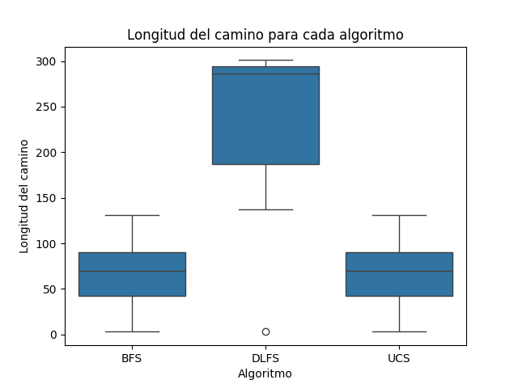
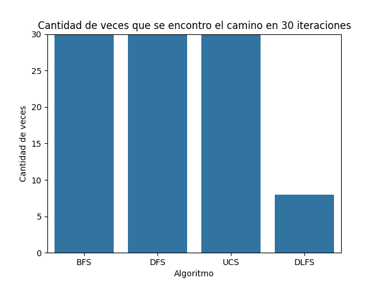

# TP3 - Búsquedas no informadas

## Grafico de cajas para nodos visitados por algoritmo

## Grafico de cajas para nodos visitados por algoritmo sin DFS

## Grafico de barras para cantidad de iteraciones exitosas

## ¿Cual es el algoritmo mas adecuado para el problema planteado?
Segun los resultados obtenidos en las distintas iteraciones, el algoritmo mas adecuado para resolver el problema A de la forma mas eficiente puede ser la busqueda en anchura o la busqueda uniforme. Esto se debe a que en la mayoria de los casos, estos algoritmos son los que menos nodos visitan para llegar a la solucion.