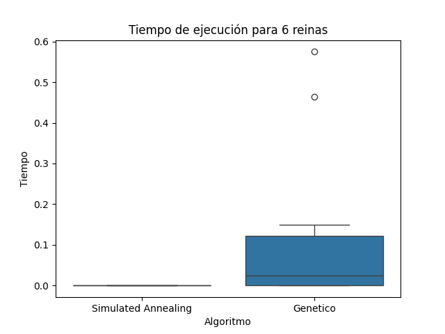

# TP5 - Busquedas Locales

## Detalles algortirmo genetico

- Definición de los individuos de la población: 
El individuo de la población se define como una permutación de los números del 0 al N-1, donde cada 
número indica la fila en la que se coloca una reina en la columna correspondiente.
- Estrategia de selección: Se eligen dos padres de la población actual, con una probabilidad de seleccion tal que los 
individuos con menos conflictos tienen una mayor probabilidad de ser seleccionados como padres.
- Estrategia de reemplazo: En cada generación, la población anterior se reemplaza completamente por una nueva población de descendientes.

- Operadores
    *  Cruce (Crossover): El cruce se realiza dividiendo a los padres en un punto de cruce aleatorio y combinando las mitades para crear dos descendientes. 
    * Mutación: La mutación se realiza cambiando aleatoriamente las posiciones de dos reinas en un individuo con una probabilidad dada. 

## Datos obtenidos para distintas reinas

### Reinas: 4

| Algoritmo | Solucionados | % Solucionados | Promedio de Pasos | Desviación Estándar de Pasos | Tiempo Promedio de Ejecución | Desviación Estándar de Tiempo |
|------------|--------------|-----------------|---------------------|-----------------------------|------------------------------|--------------------------------|
| Hill Climbing | 30 | 100.0% | 1.0 | 0.0 | 9.593e-05 segundos | 0.00044 segundos |
| Simulated Annealing | 30 | 100.0% | 7.67 | 6.23 | 8.496e-05 segundos | 0.00032 segundos |
| Genetic Algorithm | 30 | 100.0% | 0.0 | 0.0 | 0.00010 segundos | 0.00040 segundos |

### Reinas: 6

| Algoritmo | Solucionados | % Solucionados | Promedio de Pasos | Desviación Estándar de Pasos | Tiempo Promedio de Ejecución | Desviación Estándar de Tiempo |
|------------|--------------|-----------------|---------------------|-----------------------------|------------------------------|--------------------------------|
| Hill Climbing | 0 | 0.0% | No hay promedio | 0 | 0 segundos | 0 segundos |
| Simulated Annealing | 13 | 43.33% | 50.46 | 44.36 | 7.92e-05 segundos | 0.00029 segundos |
| Genetic Algorithm | 15 | 50.0% | 46.8 | 76.66 | 0.4738 segundos | 0.8355 segundos |

### Reinas: 8

| Algoritmo | Solucionados | % Solucionados | Promedio de Pasos | Desviación Estándar de Pasos | Tiempo Promedio de Ejecución | Desviación Estándar de Tiempo |
|------------|--------------|-----------------|---------------------|-----------------------------|------------------------------|--------------------------------|
| Hill Climbing | 30 | 100.0% | 2.0 | 0.0 | 0.00055 segundos | 0.00102 segundos |
| Simulated Annealing | 30 | 100.0% | 143.2 | 168.35 | 0.00114 segundos | 0.00186 segundos |
| Genetic Algorithm | 14 | 46.67% | 36.93 | 82.35 | 0.4531 segundos | 0.9845 segundos |

### Reinas: 10

| Algoritmo | Solucionados | % Solucionados | Promedio de Pasos | Desviación Estándar de Pasos | Tiempo Promedio de Ejecución | Desviación Estándar de Tiempo |
|------------|--------------|-----------------|---------------------|-----------------------------|------------------------------|--------------------------------|
| Hill Climbing | 0 | 0.0% | No hay promedio | 0 | 0 segundos | 0 segundos |
| Simulated Annealing | 27 | 90.0% | 265.22 | 216.79 | 0.00258 segundos | 0.00533 segundos |
| Genetic Algorithm | 5 | 16.67% | 68.8 | 56.62 | 1.2475 segundos | 1.0389 segundos |

## Gráficos de cajas distribución de los tiempos de ejecución de cada algoritmo que soluciona el problema. 

Cuando no aparece el algoritmo, es porque no hubo soluciones

### 4 reinas

### 6 reinas

### 8 reinas

### 10 reinas

## Variación  de la función h() a lo largo de las iteraciones. 

### Hill climbing 8 reinas

### Simulated annealing 8 reinas

## Indicar según su criterio, cuál de los tres algoritmos implementados resulta más adecuado para la solución del problema de las n-reinas. Justificar.

Para este problema, el Algoritmo Genético muestra un rendimiento consistente para todas las configuraciones de reinas evaluadas. Aunque presenta una variabilidad ligeramente mayor en los tiempos de ejecución, ofrece una solución robusta y eficiente, especialmente para problemas de tamaño moderado. 