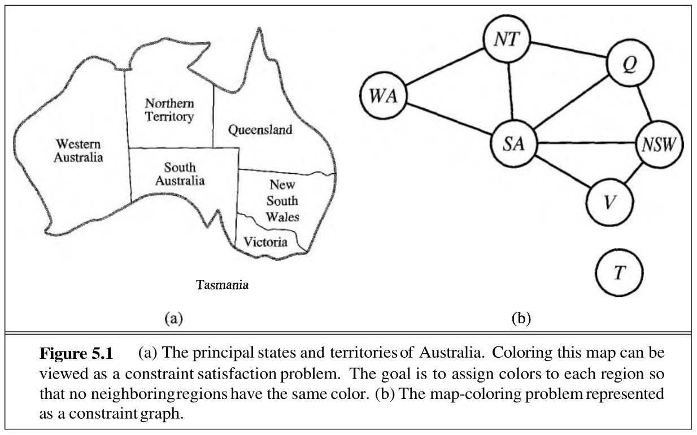
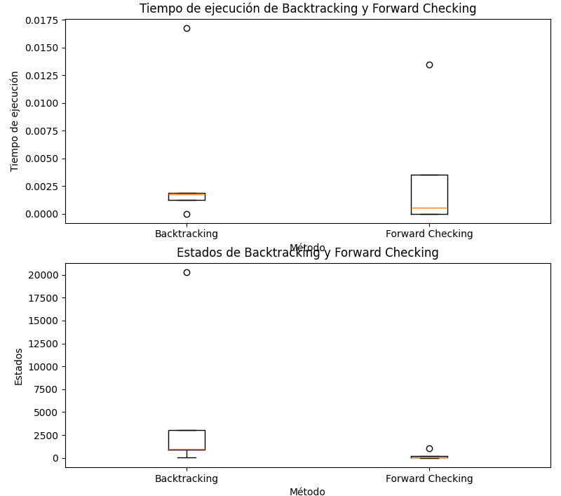

## Describir en detalle una formulación CSP para el Sudoku.
**Variables:**
- Xij: Representa el valor en la celda de la fila i y columna j del tablero de Sudoku, donde i y j van desde 1 hasta 9.

**Dominio:**
- El dominio de cada variable Xij es [1, 2, 3, 4, 5, 6, 7, 8, 9], ya que solo se permiten valores del 1 al 9 en cada celda.

**Restricciones:**
1. **Restricciones de fila:**
   - Para cada fila i, todos los valores deben ser distintos

2. **Restricciones de columna:**
   - Para cada columna j, todos los valores deben ser distintos.

3. **Restricciones de región (bloque de 3x3):**
   - Para cada bloque de 3x3 en el tablero, todos los valores deben ser distintos.

4. **Restricciones de asignación inicial:**
   - Si hay valores ya asignados inicialmente en el tablero, se deben respetar esas asignaciones.

## Utilizar el algoritmo AC-3 para demostrar que la arco consistencia puede detectar la inconsistencia de la asignación parcial {WA=red, V=blue} para el problema del colorar el mapa de Australia (Figura 5.1 AIMA 2da edición ).

Comenzamos teniendo el estado inicial (Sin asignaciones)

Se elije el color rojo para WA y se verifica la consistencia de arco

Se elije el color azul para V y se verifica la consistencia de arco

Se continua hasta llegar a: 

WA -> Rojo

NT -> Azul

Q -> -

NSW -> Rojo

V -> Azul

SA -> Verde

T -> Rojo | Azul | Verde

Luego de verificar la consistencia de arco vemos que el dominio de Q quedo vacio. Por lo tanto es inconsistente

## Cuál es la complejidad en el peor caso cuando se ejecuta AC-3 en un árbol estructurado CSP. (i.e. Cuando el grafo de restricciones forma un árbol: cualquiera dos variables están relacionadas por a lo sumo un camino).

Por la naturaleza del árbol estructurado, en la cual cada variable se conecta mediante únicamente una restricción, los arcos serán considerados solo una vez, es decir, si tenemos una cantidad E de aristas (arcos del árbol) a revisar y una cantidad D de valores en el dominio de cada variable, podemos llegar a considerar cada uno de los valores del dominio por cada uno de los arcos, llegando a una complejidad en el caso peor de O(D*E)

##  AC-3 coloca de nuevo en la cola todo arco ( Xk, Xi) cuando cualquier valor es removido del dominio de Xi incluso si cada valor de Xk es consistente con los valores restantes de Xi. Supongamos que por  cada arco ( Xk,Xi)  se puede llevar la cuenta del número de valores restantes de Xi que sean consistentes con cada valor de Xk . Explicar como actualizar ese número de manera eficiente y demostrar que la arco consistencia puede lograrse en un tiempo total O(n2d2 )

Para cada arco (Xk,Xi) llevamos un seguimiento mediante una matriz de. Esta matriz tiene filas que representan los valores de Xk y columnas que representan los valores de Xi, y se llena inicialmente con ceros.

Durante la aplicación del algoritmo AC-3 y la imposición de restricciones, actualizamos la matriz cada vez que se elimina un valor del dominio de Xi. Así, podemos determinar rápidamente si el arco (Xk,Xi) sigue siendo consistente sin tener que realizar comparaciones costosas en cada actualización.

Debido a que debemos considerar cada par de variables (Xk,Xi) y cada combinación de valores en sus dominios, la complejidad temporal de esta estrategia es (O(n^2 * d^2)), donde n es el número de variables, cada una con un dominio máximo de tamaño d. 

## Demostrar la correctitud del algoritmo CSP para  árboles estructurados (sección 5.4, p. 172 AIMA 2da edición). Para ello, demostrar: 
a- Que para un CSP cuyo grafo de restricciones es un árbol,  2-consistencia (consistencia de arco) implica n-consistencia (siendo n número total de variables)

b- Argumentar por qué lo demostrado en a. es suficiente. 

### a - Demostración:

- 2-consistencia implica n-consistencia en árboles estructurados:

La consistencia de arco, o 2-consistencia, implica que cada par de variables está relacionado por a lo sumo un camino en el grafo de restricciones. En un árbol, cualquier dos variables están conectadas por a lo sumo un único camino.

Ahora, consideremos un camino cualquiera en el grafo de restricciones que conecta dos variables arbitrarias, X y Y. Dado que estamos en un árbol, solo hay un camino posible entre X e Y. Por lo tanto, cualquier restricción entre X e Y impuesta por la consistencia de arco también se aplica a cualquier otro par de variables en el árbol.

Como resultado, si todas las restricciones entre pares de variables son 2-consistentes, todas las restricciones entre todas las variables en el árbol son n-consistentes.

### b - Por qué es suficiente:

En un árbol, la consistencia de arco es suficiente porque cada variable se relaciona con todas las demás a través de un único camino. Al garantizar la consistencia de arco, estamos asegurando que no hay conflictos entre las restricciones impuestas por diferentes caminos en el árbol.

## Implementar una solución al problema de las n-reinas utilizando una formulación CSP

* Implementar una solución utilizando backtracking

* Implementar una solución utilizando encadenamiento hacia adelante.

* En cada variante, calcular los tiempos de ejecución para los casos de 4, 8, 10, 12 y 15 reinas. En cada variante, calcular la cantidad de estados recorridos antes de llegar a la solución para los casos de 4, 8, 10, 12 y 15 reinas.

| Algoritmo               | Reinas | Cantidad de Estados | Tiempo de Ejecución |
|-------------------------|--------|----------------------|----------------------|
| Backtracking    | 4      | 26                   | 0.0                  |
| Forward Checking | 4      | 8                    | 0.0                  |
| Backtracking  | 8      | 876                  | 0.008                |
| Forward Checking| 8      | 88                   | 0.0                  |
| Backtracking   | 10     | 975                  | 0.0                  |
| Forward Checking | 10    | 83                   | 0.0                  |
| Backtracking  | 12     | 3066                 | 0.0                  |
| Forward Checking | 12    | 193                  | 0.0                  |
| Backtracking   | 15     | 20280                | 0.02399              |
| Forward Checking | 15    | 1026                 | 0.00801              |

* Realizar un gráfico de cajas para los puntos c y d.

