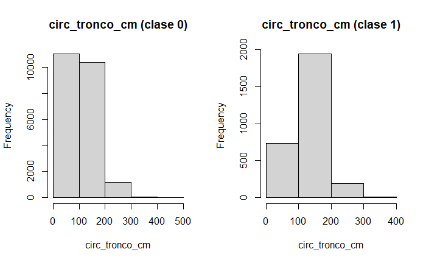

# PARTE A

### Punto 2

- ¿Cual es la distribución de la clase inclinacion_peligrosa?

Se puede observar que las clases se encuentran desbalanceadas. La mayoria de los elementos no posee una inclinacion peligrosa.

- ¿Se puede considerar alguna sección mas peligrosa que otra?

Se puede observar que la segunda y tercera seccion tienen mayor cantidad de arboles con inclinacion peligrosa, por lo que podríamos considerarlas mas peligrosas.

- ¿Se puede considerar alguna especia mas peligrosa que otra?

En el grafico podemos ver una diferencia notable entre la especie de los algarrobos y las demas, por lo que podríamos considerarla una especia mas peligrosa.

### Punto 3

#### Histograma de frecuencia circ_tronco_cm

- 5 bins

- 10 bins

- 20 bins

#### Histogramas separados por inclinacion peligrosa

- 5 bins

- 10 bins

- 20 bins

#### Corte

A partir de la informacion de los histogramas y el analisis de la media, se decidió realizar la categorizacion de la siguiente manera 

Bajo (0-50)

Medio (50-150)

Alto (150-250)

Muy alto (250-500)

Quedando las clases distribuidas de la siguiente forma 

